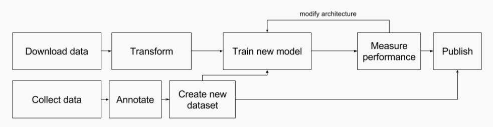
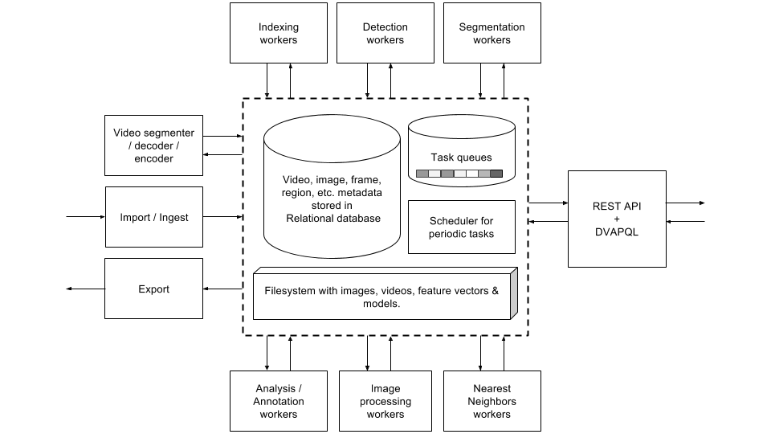
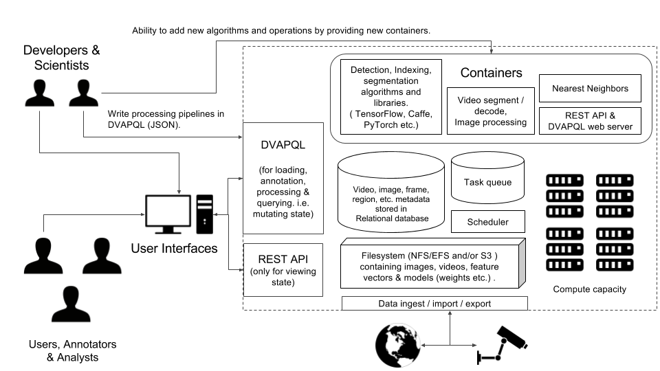

# Towards large scale intelligent systems that learn continuously and interactively in a reproducible manner

### State of AI/ML libraries & frameworks
Over the last five years with emergence of deep learning, several libraries/frameworks such as Caffe, Torch, 
PyTorch, Tensor Flow have become popular. Each new library has solved several problems such as model portability,
distributed training, autograd, etc. For an overview of evolution of Deep Learning Libraries listen 
to this [podcast by Soumith (one of the creator or PyTorch)](https://www.oreilly.com/ideas/why-ai-and-machine-learning-researchers-are-beginning-to-embrace-pytorch).

However libraries such as PyTorch, Caffe and TensorFlow, only specify model and training/inference. A significant part
Computer Vision research and applications involves data collection, annotation, organization. Currently there 
are no frameworks that support these tasks. The closest equivalent would be something like Robot Operating System (ROS)
in robotics.  

### Towards a data-centric approach
Currently most of the published research in Computer Vision uses a model-centric pattern illustrated above. 
Typically researchers download existing dataset or collect & annotate new data. Either a baseline model or
 a new model is proposed for solving a particular problem (detection, segmentation, counting etc.) 
 While the pattern described above works well for specific tasks, it slows the research in Computer Vision, 
 especially in topics such as interactive learning or learning by continuously ingesting data.
 

As a solution to this problem we present Deep Video Analytics a data-centric system. Deep Video Analytics,
imposes structure on not only models and data but also on the processing pipeline. Deep Video Analytics can
be thought of being similar to a traditional relational database. 

### Learning continuously/interactively while maintaining reproducibility

Several researcher have proposed systems that learn continuously by surfing web or through user interaction.
However these studies typically do not share code used for building the system, even if the code is shared 
its written in manner that is not amenable to modification. 

### Architecture for distributed intelligence

### Language, Data model & Implementation

  
### Practical scaling with containers, spot/premptible and lambda
With advent of cloud computing, its now possible to launch thousands of short lived tasks to
10~100s of instances with GPUs. Building systems capable of leveraging this type of computing power
 is not trivial, further until now such systems required significant amount of DevOPs / Systems Administration.
 However with advent of containers which abstract away all OS level components such as libraries, drivers etc. and
 container orchestration systems such as Kubernetes (supported by Google Container Engines) and AWS Elastic Container 
 Service. It is now possible to deterministically specify all components. 
 
 

### From yearly competitions to near-realtime collaboration 

Today yearly competitions such as COCO, ILSVRC are the main form of establishing state of the art. 
 