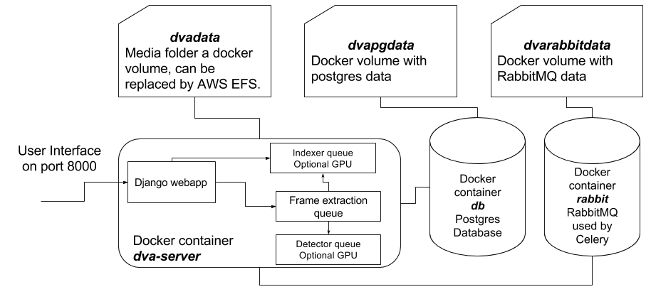

#Deep Video Analytics  •  [](https://travis-ci.org/AKSHAYUBHAT/DeepVideoAnalytics)


#### Author [Akshay Bhat, Cornell University.](http://www.akshaybhat.com)       


Deep Video Analytics provides a platform for indexing and extracting information from videos and images.
Deep learning detection and recognition algorithms are used for indexing individual frames/images along with 
detected objects. The goal of Deep Video analytics is to become a quickly customizable platform for developing 
visual & video analytics applications, while benefiting from seamless integration with state or the art models & datasets
released by the vision research community.

[For quick overview of vision behind this project please go through this presentation.](https://docs.google.com/presentation/d/1nweK60ywx1h-MMg75oo0E5jwBQtrFIVK6hPgMuB985U/edit?usp=sharing)

##### self-promotion: If you are interested in Healthcare & Machine Learning please take a look at my another Open Source project [Computational Healthcare](http://www.computationalhealthcare.com) 

## Features
- Visual Search using Nearest Neighbors algorithm as a primary interface
- Upload videos, multiple images (zip file with folder names as labels)
- Provide Youtube url to be automatically processed/downloaded by youtube-dl
- Leverage pre-trained object recognition/detection, face recognition models for analysis and visual search.
- Query against pre-indexed external datasets containing millions of images.
- Metadata stored in Postgres, Operations performed asynchronously using celery tasks. 
- Separate queues and workers for selection of machines with different specifications (GPU vs RAM).
- Videos, frames, indexes, numpy vectors stored in media directory, served through nginx
- Explore data, manually run code & tasks without UI via a jupyter notebook [explore.ipynb](experiments/Notebooks/explore.ipynb)
- [Some documentation on design decision, architecture and deployment](/notes/readme.md).


## Models included out of the box
**We take significant efforts to ensure that following models (code+weights included) work without having to write any code.**

- [x] Indexing using Google inception V3 trained on Imagenet
- [x] [Single Shot Detector (SSD) Multibox 300 training using VOC](https://github.com/balancap/SSD-Tensorflow)  
- [x] Alexnet using Pytorch  (disabled by default; set ALEX_ENABLE=1 in environment variable to use)
- [x] [YOLO 9000](http://pjreddie.com/darknet/yolo/) (disabled by default; set YOLO_ENABLE=1 in environment variable to use)
- [x] [Face detection/alignment/recognition using MTCNN and Facenet](https://github.com/davidsandberg/facenet) 

## External datasets indexed for use

- [ ] [Product images data (coming soon!)](http://www.product-open-data.com/download/)
- [ ] [Visual Genome (coming soon!)](http://visualgenome.org/)

## Planned models and datasets

- [ ] [MultiNet or KittiBox](https://github.com/MarvinTeichmann/MultiNet)
- [ ] [Text detection models](http://www.robots.ox.ac.uk/~vgg/research/text/)
- [ ] [Soundnet (requires extracting mp3 audio)](http://projects.csail.mit.edu/soundnet/)
- [ ] [Open Images dataset pretrained inception v3](https://github.com/openimages/dataset)   
- [ ] [Keras-js](https://github.com/transcranial/keras-js) which uses Keras inception for client side indexing   

## Approximate Nearest Neighbors indexing algorithms

- [ ] [Yahoo/Flickr Locally Optimized Product Quantization (currently being integrated for querying external data)](https://github.com/yahoo/lopq)
- [ ] [Facebook FAISS for fast approximate similarity search (lower priority)](https://github.com/facebookresearch/faiss)


## To Do
[Please take a look at this board for planned future tasks](https://github.com/AKSHAYUBHAT/DeepVideoAnalytics/projects/1)

## Installation

**Pre-built docker images for both CPU & GPU versions are [available on Docker Hub](https://hub.docker.com/r/akshayubhat/dva/tags/).** 

### Machines without an Nvidia GPU
Deep Video analytics is implemented using Docker and works on Mac, Windows and Linux. 

````bash
git clone https://github.com/AKSHAYUBHAT/DeepVideoAnalytics 
cd DeepVideoAnalytics/docker && docker-compose up 
````

### Machines with Nvidia GPU 
You need to have latest version of Docker and nvidia-docker installed.
The GPU Dockerfile is slightly different from the CPU version dockerfile.


```bash
pip install --upgrade nvidia-docker-compose
git clone https://github.com/AKSHAYUBHAT/DeepVideoAnalytics 
cd DeepVideoAnalytics/docker_GPU && ./rebuild.sh 
nvidia-docker-compose up 
```

### Multiple machines
Its possible to deploy Deep Video Analytics on multiple machines. Configuring Postgres and RabbitMQ is straightforward. The main issues is correctly mounting the shared media folder (ideally a mounted EFS or NFS).
Please [read this regarding trade offs](https://github.com/AKSHAYUBHAT/DeepVideoAnalytics/blob/master/notes/architecture.md).

### Amazon P2 instance
We provide an AMI with all dependencies such as docker & nvidia drivers pre-installed. 
To use it start a P2.xlarge instance with **ami-b3cc1fa5** (N. Virginia) and ports 8000, 6006, 8888 open (preferably to only your IP). 
Run following commands after logging into the machine via SSH. 
```bash
cd deepvideoanalytics && git pull 
cd docker_GPU && ./rebuild.sh && nvidia-docker-compose up 
```
You can optionally specify "-d" at the end to detach it, but for the very first time its useful to read how each container is started. After approximately 5 ~ 1 minutes the user interface will appear on port 8000 of the instance ip.
The Process used for [AMI creation is here](https://github.com/AKSHAYUBHAT/DeepVideoAnalytics/blob/master/notes/ami.md) 

**Security warning:** The current GPU container uses nginx <-> uwsgi <-> django setup to ensure smooth playback of videos. 
However it runs nginix as root (though within the container). Considering that you can now modify AWS Security rules on-the-fly, I highly recommend allowing inbound traffic only from your own IP address.)


## Options
Following options can be specified in docker-compose.yml, or your environment to selectively enable/disable algorithms.

- ALEX_ENABLE=1 (to use Alexnet with PyTorch. Otherwise disabled by default)
- YOLO_ENABLE=1 (to use YOLO 9000. Otherwise disabled by default)
- SCENEDETECT_DISABLE=1 (to disable scene detection, Otherwise enabled by default)

 
## Architecture


## User Interface 
#### Search across frames

#### And specific detected objects such as Faces

#### Past queries


#### Video list / detail


#### Frame detail

#### View status of running tasks/queries, retry/rerun failed tasks


## Libraries & Code used

- Pytorch [License](https://github.com/pytorch/pytorch/blob/master/LICENSE)
- Darknet [License](https://github.com/pjreddie/darknet/blob/master/LICENSE)
- AdminLTE2 [License](https://github.com/almasaeed2010/AdminLTE/blob/master/LICENSE)
- FabricJS [License](https://github.com/kangax/fabric.js/blob/master/LICENSE)
- Modified PySceneDetect [License](https://github.com/Breakthrough/PySceneDetect)
- Modified SSD-Tensorflow [Individual files are marked as Apache](https://github.com/balancap/SSD-Tensorflow)
- FAISS [License (Non Commercial)](https://github.com/facebookresearch/faiss)
- Facenet [License](https://github.com/davidsandberg/facenet)
- MTCNN [TensorFlow port of MTCNN for face detection/alignment](https://github.com/kpzhang93/MTCNN_face_detection_alignment)
- Locally Optimized Product Quantization [License](https://github.com/yahoo/lopq/blob/master/LICENSE)
- Docker 
- Nvidia-docker
- OpenCV
- Numpy
- FFMPEG
- Tensorflow

# References

1. Schroff, Florian, Dmitry Kalenichenko, and James Philbin. "Facenet: A unified embedding for face recognition and clustering." Proceedings of the IEEE Conference on Computer Vision and Pattern Recognition. 2015.
2. Szegedy, Christian, et al. "Going deeper with convolutions." Proceedings of the IEEE Conference on Computer Vision and Pattern Recognition. 2015.
3. Zhang, Kaipeng, et al. "Joint Face Detection and Alignment Using Multitask Cascaded Convolutional Networks." IEEE Signal Processing Letters 23.10 (2016): 1499-1503.
4. Liu, Wei, et al. "SSD: Single shot multibox detector." European Conference on Computer Vision. Springer International Publishing, 2016.
5. Redmon, Joseph, et al. "You only look once: Unified, real-time object detection." Proceedings of the IEEE Conference on Computer Vision and Pattern Recognition. 2016.
6. Krizhevsky, Alex, Ilya Sutskever, and Geoffrey E. Hinton. "Imagenet classification with deep convolutional neural networks." Advances in neural information processing systems. 2012.	
7. Johnson, Jeff, Matthijs Douze, and Hervé Jégou. "Billion-scale similarity search with GPUs." arXiv preprint arXiv:1702.08734 (2017).

# Citation 

**Citation for Deep Video Analytics coming soon.**

# Copyright

**Copyright 2016-2017, Akshay Bhat, Cornell University, All rights reserved.**
Please contact me for more information, I plan on relaxing the license soon, once a beta version is reached 
(To the extent allowed by the code/models included.e.g. FAISS disallows commercial use.). 
 
