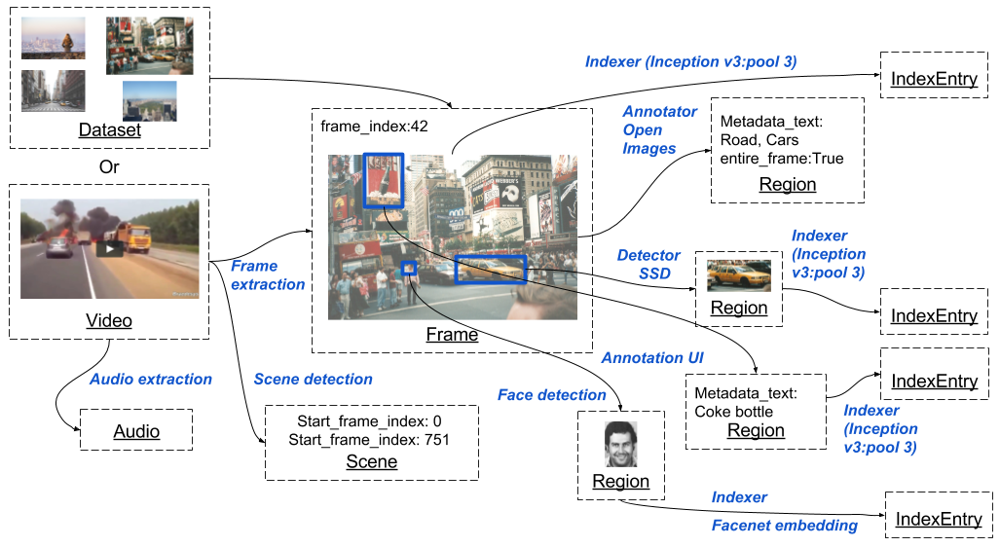

# Deep Video Analytics  •  

 

**Don't be worried by complexity of this banner, with latest version of docker installed correctly, you can run Deep Video Analytics in minutes locally (even without a GPU) using a single command.** 
### Data & processing model

#### Author: [Akshay Bhat, Cornell University.](http://www.akshaybhat.com)

#### Deep Video Analytics is a platform for indexing and extracting information from videos and images. For installation instructions & demo go to [https://www.deepvideoanalytics.com](https://www.deepvideoanalytics.com)

#### Libraries used and their licenses

- Pytorch [License](https://github.com/pytorch/pytorch/blob/master/LICENSE)
- YAD2K: Yet Another Darknet 2 Keras [License](https://github.com/allanzelener/YAD2K)
- AdminLTE2 [License](https://github.com/almasaeed2010/AdminLTE/blob/master/LICENSE)
- FabricJS [License](https://github.com/kangax/fabric.js/blob/master/LICENSE)
- Modified PySceneDetect [License](https://github.com/Breakthrough/PySceneDetect)
- Modified SSD-Tensorflow [Individual files are marked as Apache](https://github.com/balancap/SSD-Tensorflow)
- Facenet [License](https://github.com/davidsandberg/facenet)
- MTCNN [TensorFlow port of MTCNN for face detection/alignment](https://github.com/kpzhang93/MTCNN_face_detection_alignment)
- Locally Optimized Product Quantization [License](https://github.com/yahoo/lopq/blob/master/LICENSE)
- Open Images Pre training network for text tags [License](https://github.com/openimages/dataset/blob/master/LICENSE) 
- JSFeat [not used but included](https://inspirit.github.io/jsfeat/)
- Segment annotator [Not used but inclued](https://github.com/kyamagu/js-segment-annotator/blob/master/LICENSE)
- FFmpeg [Not linked, used only through a command line interface.](https://www.ffmpeg.org/legal.html)
- Tensorflow [License](https://github.com/tensorflow/tensorflow/blob/master/LICENSE)
- FAISS [License (CC-BY-NC) will likely be removed from release candidate](https://github.com/facebookresearch/faiss)
- Nvidia-docker
- Docker
- OpenCV
- Numpy

# License & Copyright

**Copyright 2016-2017, Akshay Bhat, Cornell University, All rights reserved.**

Please contact me for more information, I plan on relaxing the license soon.
For more information about the approximate timeline see [my answer on this issue](https://github.com/AKSHAYUBHAT/DeepVideoAnalytics/issues/29)
 
