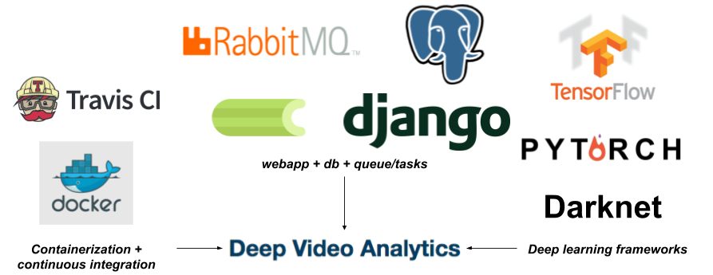
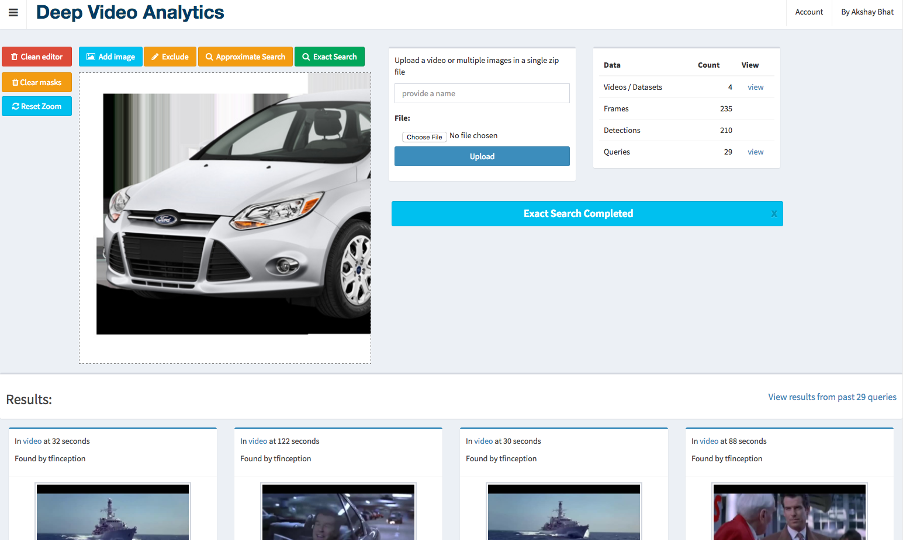
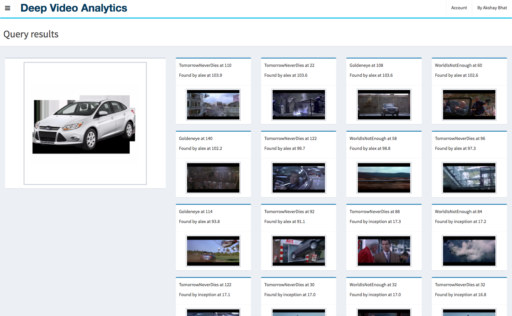
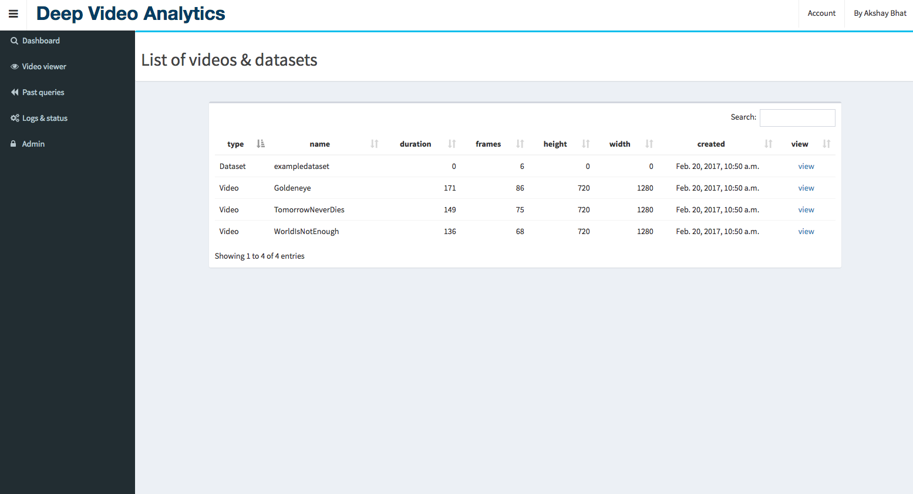
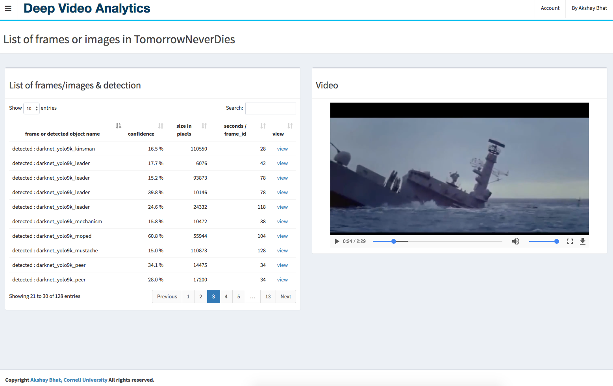

#Deep Video Analytics  •  [](https://travis-ci.org/AKSHAYUBHAT/DeepVideoAnalytics)
##### Akshay Bhat, Cornell University. [Website & Contact](http://www.akshaybhat.com)       

Deep Video Analytics provides a platform for indexing and extracting information from videos and images.
Deep learning detection and recognition algorithms are used for indexing individual frames / images along with 
detected objects. The goal of Deep Video analytics is to become a quickly customizable platform for developing 
visual & video analytics applications, while benefiting from seamless integration with state or the art models released
by the vision research community.

##### Advertisement: If you are interested in Healthcare & Machine Learning please take a look at [Computational Healthcare](http://www.computationalhealthcare.com) 

## Features
- Visual Search using Nearest Neighbors algorithm as a primary interface
- Upload videos, multiple images (zip file with folder names as labels)
- Provide Youtube url to be automatically processed/downloaded by youtube-dl
- Metadata stored in Postgres
- Operations (Querying, Frame extraction & Indexing) performed using celery tasks and RabbitMQ
- Separate queues and workers for selection of machines with different spect (GPU vs RAM) 
- Videos, frames, indexes, numpy vectors stored in media directory, served through nginx
- Explore data, manually run code & tasks without UI via a jupyter notebook (e.g. [explore.ipynb](https://github.com/AKSHAYUBHAT/DeepVideoAnalytics/blob/master/explore.ipynb))

---
## Installation

### One line installation using docker-compose

````bash
git clone https://github.com/AKSHAYUBHAT/DeepVideoAnalytics && cd DeepVideoAnalytics/docker && docker-compose up 
```
### Installation for machines with GPU or AWS EC2 P2.xlarge instances

#### Machine with GPU
Replace docker-compose by nvidia-docker-compose, the Dockerfile uses tensorflow gpu base image and appropriate version of pytorch. The Makefile for Darknet is also modified accordingly. This code was tested using an older NVidia Titan GPU and nvidia-docker.

```bash
pip install --upgrade nvidia-docker-compose
git clone https://github.com/AKSHAYUBHAT/DeepVideoAnalytics && cd DeepVideoAnalytics/docker_GPU && nvidia-docker-compose up 
```
#### AWS EC2 AMI
Start a P2.xlarge instance with **ami-b3cc1fa5** (N. Virginia), ports 8000, 6006, 8888 open (preferably to only your IP) and run following command after ssh'ing into the machine. 
```bash
cd deepvideoanalytics && git pull && cd docker_GPU && ./rebuild.sh && nvidia-docker-compose up 
```
you can optionally specify "-d" at the end to detach it, but for the very first time its useful to read how each container is started. After approximately 3 ~ 5 minutes the user interface will appear on port 8000 of the instance ip.
The Process used for [AMI creation is here](https://github.com/AKSHAYUBHAT/DeepVideoAnalytics/blob/master/notes/ami.md)

**Security warning! The current GPU container uses nginx <-> uwsgi <-> django setup to ensure smooth playback of videos. 
However it runs nginix as root (though within the container). Considering that you can now modify AWS Security rules on-the-fly, I highly recommend only allowing inbound traffic from your own IP address.** 

#### Deploying on multiple machine with shared NFS storage


## User Interface 
### Search

### Past queries

### Video list / detail


### Frame detail


##Alpha version To Do list
**Deep Video Analytics is currently under active development.**

- [x] Django App
- [x] Tasks using Celery & RabbitMQ
- [x] Postgres database
- [x] Deployment using docker-compose
- [x] Minimal user interface for uploading and browsing uploaded videos/images
- [x] Task for frame extraction from videos
- [x] Simple detection models using Darknet YOLO
- [x] Working visual search & indexer tasks using PyTorch
- [X] Simple set of tests (E.g. upload a video, perform processing, indexing, detection)
- [X] Deployment using nvidia-docker-compose for machines with GPU
- [X] Continuous integration test suite
- [X] Improved user interface for browsing past queries
- [X] Improve TEvent model to track state of tasks
- [X] Improved frame extraction using PySceneDetect (every 100th frame and frame selected by content change)
- [X] Integrate Tensorflow 1.0
- [X] Improved models by adding information about user performing the uploading video/dataset
- [X] Automated docker based testing
- [X] Implement a method to backup postgres db & media folder to S3 via a single command
- [X] Integrate youtube-dl for downloading videos
- [X] Test Deployment on AWS P2 machines running nvidia-docker 
- [X] Implemented nginx <-> uwsgi <-> django on GPU container for optimized serving of videos and static assets.
- [ ] Index detected object / create a separate query indexer using NMS lib or Anony


### Implemented & Potential algorithms/models
- [x] Alexnet indexing using Pytorch 
- [x] [YOLO 9000 (naive implementation, gets reloaded in memory for every video)](http://pjreddie.com/darknet/yolo/)
- [x] Google inception using Tensorflow 
- [ ] [Pytorch Squeezenet](http://pytorch.org/docs/torchvision/models.html)
- [ ] [Facenet](https://github.com/davidsandberg/facenet) or [Openface (via a connected container)](https://github.com/cmusatyalab/openface)
- [ ] [Soundnet](http://projects.csail.mit.edu/soundnet/)
- [ ] [Mapnet (requires converting models from Marvin)](http://www.cs.princeton.edu/~aseff/mapnet/)   
- [ ] [Keras-js](https://github.com/transcranial/keras-js) which uses Keras inception for client side indexing   
 
## Distributed architecture


## Libraries & Code used
- Pytorch [License](https://github.com/pytorch/pytorch/blob/master/LICENSE)
- Darknet [License](https://github.com/pjreddie/darknet/blob/master/LICENSE)
- AdminLTE2 [License](https://github.com/almasaeed2010/AdminLTE/blob/master/LICENSE)
- FabricJS [License](https://github.com/kangax/fabric.js/blob/master/LICENSE)
- Modified PySceneDetect [License](https://github.com/Breakthrough/PySceneDetect)
- Docker 
- Nvidia-docker
- OpenCV
- Numpy
- FFMPEG
- Tensorflow

# Copyright
**Copyright 2016-2017, Akshay Bhat, Cornell University, All rights reserved.**
