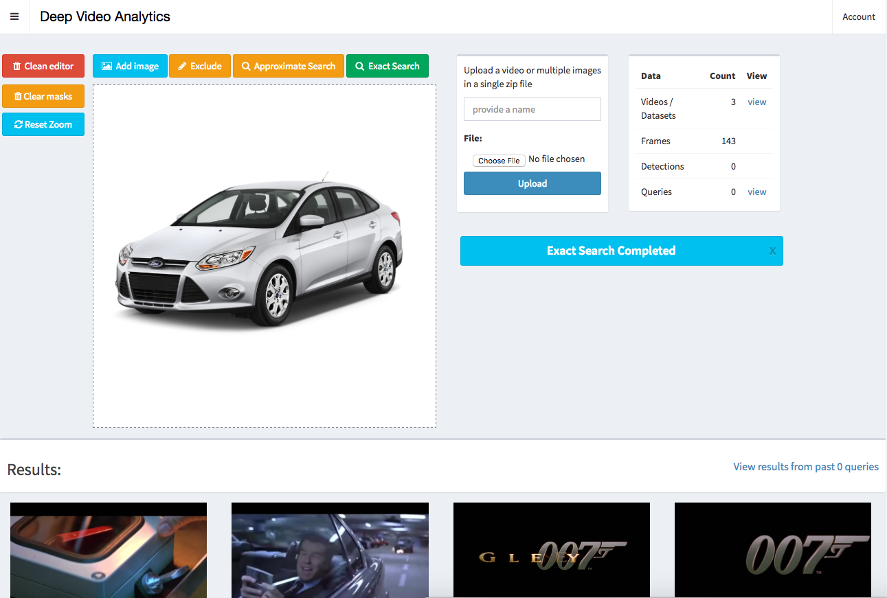

#Deep Video Analytics
##### Akshay Bhat, Cornell University. [Website & Contact](http://www.akshaybhat.com)
Travis CI build status : [](https://travis-ci.org/AKSHAYUBHAT/DeepVideoAnalytics)  
Docker hub CPU image: [](https://microbadger.com/images/akshayubhat/deepvideoanalytics "Get your own image badge on microbadger.com")  

Deep Video Analytics provides a platform for indexing and extracting information from videos and images.
Deep learning detection and recognition algorithms are used for indexing individual frames / images along with 
detected objects. The goal of Deep Video analytics is to become a quickly customizable platform for developing 
visual & video analytics applications, while benefiting from seamless integration with state or the art models released
by the vision research community. 

### Installation using docker-compose

````bash
git clone https://github.com/AKSHAYUBHAT/DeepVideoAnalytics 
cd DeepVideoAnalytics/docker
docker-compose up 
````
### Installation for machines with GPU

Replace docker-compose by nvidia-docker-compose, the Dockerfile uses tensorflow gpu base image and appropriate version of pytorch.
The Makefile for Darknet is also modified accordingly. This code was tested using an older NVidia Titan GPU and nvidia-docker.

````bash
git clone https://github.com/AKSHAYUBHAT/DeepVideoAnalytics 
cd DeepVideoAnalytics/docker_GPU
pip install --upgrade nvidia-docker-compose
nvidia-docker-compose up 
````

### User Interface (Alpha version still under development)



##To Do list
**Deep Video Analytics is currently under active development.**

- [x] Django App
- [x] Tasks using Celery & RabbitMQ
- [x] Postgres database
- [x] Deployment using docker-compose
- [x] Minimal user interface for uploading and browsing uploaded videos/images
- [x] Task for frame extraction from videos
- [x] Simple detection models using Darknet YOLO
- [x] Working visual search & indexer tasks using PyTorch
- [X] Simple set of tests (E.g. upload a video, perform processing, indexing, detection)
- [X] Deployment using nvidia-docker-compose for machines with GPU
- [X] Continuous integration test suite
- [X] Improved user interface for browsing past queries
- [X] Improve TEvent model to track state of tasks
- [ ] Incorporate metadata from (PySceneDetect)[https://github.com/Breakthrough/PySceneDetect]
- [ ] Integrate Tensorflow/Keras 
- [ ] Index detected object 
- [ ] Move global settings (such as resolution of extracted frame etc.) into a global config file
- [ ] Deployment on AWS P2 machines
- [ ] Separate frame-indexer and query-indexer tasks
- [ ] Implement approximate nn search via NMS lib or Anony
- [ ] Implement a method to backup postgres db & media folder to S3 via a single command
- [ ] Improved models by adding information about user performing the query/uploading video/dataset
- [ ] Convert Darknet detection model into Tensorflow or Pytorch 
- [ ] Evaluate feasibility of integrating [Keras-js](https://github.com/transcranial/keras-js) for client side indexing.

### Implemented & Potential algorithms/models
- [x] Alexnet indexing using Pytorch 
- [x] [YOLO 9000 (naive implementation, gets reloaded in memory for every video)](http://pjreddie.com/darknet/yolo/)
- [x] Google inception using Tensorflow **(GPU tests pending)**
- [ ] [Pytorch Squeezenet](http://pytorch.org/docs/torchvision/models.html)
- [ ] [Face recognition using Facenet](https://github.com/davidsandberg/facenet)
- [ ] [Soundnet](http://projects.csail.mit.edu/soundnet/)
- [ ] [Mapnet (tricky requires converting models from Marvin)](http://www.cs.princeton.edu/~aseff/mapnet/) 
 
   
 
### Distributed architecture


- Metadata stored in Postgres.
- Operations (Querying, Frame extraction & Indexing) performed using celery tasks and RabbitMQ.
- Separate queues and workers to allow selection of machines with GPU & RAM for specific tasks such as indexing / computing features.
- Videos, frames, indexes, numpy vectors stored in media directory.

### Explore without User Interface

You can use the jupyter notebook explore.ipynb to manually run tasks & code against the databases. 

### Simple schema for extensibility

 - One directory per video or dataset (a set of images)
 - Extracted frames and detections are stored in detections/ & frames/ under the video directory
 - Indexes (numpy arrays) and list of corresponding frames & detections are stored 
 - Query images are also stored inside media/queries/ named using primary key of the query object.
 - Designed to enables rapid sync with S3 or processing via a third party program.

Media directory organization example: 
```
media/
├── 1
│   ├── audio
│   ├── detections
│   ├── frames
│   │   ├── 0.jpg
│   │   ├── 10.jpg
│   │   ...
│   │   └── 98.jpg
│   ├── indexes
│   │   ├── alexnet.framelist
│   │   └── alexnet.npy
│   └── video
│       └── 1.mp4
├── 2
│   └── video
│       └── 2.mp4
│   ├── detections
│   ├── frames
│   │   ├── 0.jpg
│   │   ├── 10.jpg
...
└── queries
    ├── 1.png
    ├── 10.png
    ....
    ├── 8.png
    └── 9.png

19 directories, 257 files
```

# Libraries & Code used
- Pytorch [License](https://github.com/pytorch/pytorch/blob/master/LICENSE)
- Darknet [License](https://github.com/pjreddie/darknet/blob/master/LICENSE)
- AdminLTE2 [License](https://github.com/almasaeed2010/AdminLTE/blob/master/LICENSE)
- FabricJS [License](https://github.com/kangax/fabric.js/blob/master/LICENSE)

# Copyright
Copyright, Akshay Bhat, Cornell University, All rights reserved.